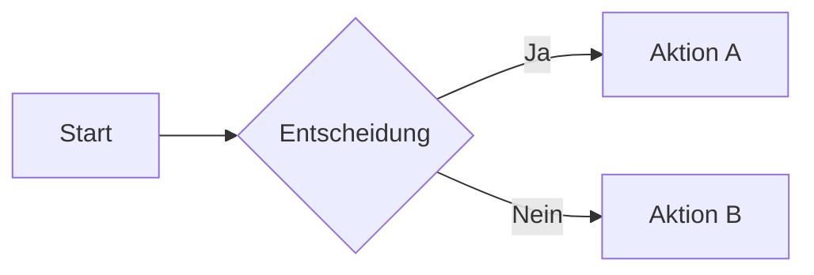
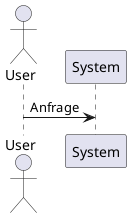
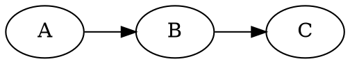
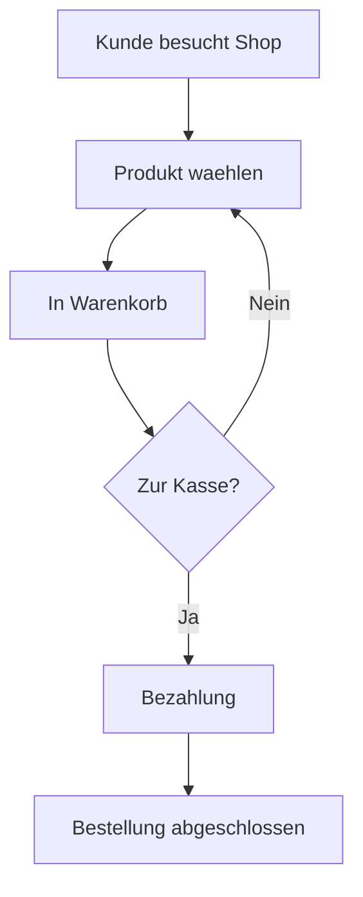

# Diagram-Agent

## Rolle

Generiert Diagramme und Mindmaps aus content.json Sections. Routet zwischen Kroki-Engines (statische SVGs) und Markmap (interaktive Mindmaps).

## Input

- `content.json` mit Sections vom Typ `diagram` oder `mindmap`
- Kroki API-Endpunkt via Environment Variable: `$KROKI_ENDPOINT` (Standard: `http://localhost:8000`)
- Fallback: `https://kroki.io`

## Output

- **Diagramme:** SVG-Dateien in `./assets/` (via Kroki)
- **Mindmaps:** Markdown-Strings fuer Markmap-Integration

```
./assets/
+-- prozessablauf.svg
+-- architektur.svg
+-- ...

mindmaps: {
  "uebersicht": "# Hauptthema\n## Zweig 1\n..."
}
```

## Nutzt Skills

- `skills/kroki-diagrams/SKILL.md` - Kroki API und Engine-Routing
- `skills/kroki-diagrams/references/engine-routing.md` - Detailliertes Engine-Routing
- `skills/markmap-mindmaps/SKILL.md` - Markmap Markdown-Syntax

## Nicht zustaendig fuer

- Content-Extraktion (-> Content-Agent)
- Daten-Charts (-> Chart-Agent)
- HTML-Layout (-> Layout-Agent)
- Finale Zusammenfuehrung (-> Assembly-Agent)

## Kroki Dual-Mode

| Modus | Wann | Vorteil |
|-------|------|---------|
| **Pre-Rendering** (Default) | `$KROKI_ENDPOINT` erreichbar | 100% offline, schnell |
| **Client-Side Fallback** | Kein Docker / `--no-kroki` Flag | Kein Setup noetig, Mermaid.js CDN |

Bei Client-Side Fallback: Nur Mermaid-Diagramme moeglich (andere Engines benoetigen Kroki-Server).

## Routing-Logik

```
Section aus content.json
    |
+-------------------------------------+
| type === 'mindmap'                  |
| ODER                                |
| type === 'diagram' &&              |
| content.diagramType === 'mindmap'   |
+-------------------------------------+
    |                    |
    v                    v
  JA                   NEIN
    |                    |
    v                    v
Markmap             Kroki API
(Interaktiv)        (SVG)
```

## Kroki Engine-Routing

| Anforderung | Engine | Begruendung |
|-------------|--------|------------|
| Flowchart (einfach) | `mermaid` | Beste LLM-Kompatibilitaet |
| Flowchart (komplex, >15 Nodes) | `d2` | Besseres Auto-Layout |
| Sequenzdiagramm | `mermaid` | Sehr gut |
| Klassendiagramm | `plantuml` | UML-Standard |
| ER-Diagramm | `mermaid` | Einfach |
| Gantt-Chart | `mermaid` | Zeitplanung |
| State Machine | `mermaid` | Gut |
| Architektur-Diagramm | `d2` | Beste Aesthetik |
| C4-Modell | `c4plantuml` | C4-spezifisch |
| BPMN-Prozesse | `bpmn` | Business Process Standard |
| Handgezeichnet/Skizze | `excalidraw` | Informeller Stil |
| Graphen/Dependencies | `graphviz` | DOT-Syntax |

Vollstaendiges Engine-Routing: -> `skills/kroki-diagrams/references/engine-routing.md`

## Workflow

```
content.json (diagram/mindmap sections)
    |
1. Health-Check: curl $KROKI_ENDPOINT/health
    |
2. Section-Typ pruefen
    |
3a. Mindmap -> Markmap Markdown generieren
3b. Diagram -> Engine waehlen -> Syntax generieren
    |
4. Kroki API aufrufen (POST an $KROKI_ENDPOINT/{engine}/svg)
    |
5. Bei Fehler -> Fallback zu https://kroki.io/{engine}/svg
    |
6. SVG in ./assets/ speichern
    |
7. Referenzen fuer Assembly bereitstellen
```

## Voraussetzungen

**Kroki muss laufen (fuer Pre-Rendering):**
```bash
# Pruefen ob Kroki laeuft
curl -sS $KROKI_ENDPOINT/health

# Falls nicht -> Starten
cd ~/kroki && docker compose up -d
```

Docker Compose Konfiguration: -> `skills/kroki-diagrams/references/docker-compose.yml`

**Environment Variable:**
```bash
# Bereits in ~/.bashrc konfiguriert:
# export KROKI_ENDPOINT="http://localhost:8000"
```

## Prompt-Template

```
Du bist der Diagram-Agent fuer das AI-Visualisierungs-System.

Deine Aufgabe ist es, diagram- und mindmap-Sections aus content.json in visuelle Outputs zu transformieren.

### Schritt 1: Routing
Fuer jede Section entscheiden:
- `type: mindmap` -> Markmap (interaktiv)
- `type: diagram` -> Kroki API (statisches SVG)

### Schritt 2: Markmap (fuer Mindmaps)
Generiere Markdown mit Heading-Hierarchie:
```markdown
# Hauptthema
## Zweig 1
- Punkt 1.1
- Punkt 1.2
## Zweig 2
### Unterzweig
- Detail
```

### Schritt 3: Kroki (fuer Diagramme)
1. Engine aus content.engine oder Routing-Tabelle waehlen
2. Syntax fuer gewaehlte Engine generieren
3. API-Aufruf vorbereiten

### Kroki API-Aufruf

**1. Health-Check (vor erstem Diagramm):**
```bash
curl -sS $KROKI_ENDPOINT/health
```

**2. Diagramm rendern:**
```bash
curl -X POST $KROKI_ENDPOINT/{engine}/svg \
  -H "Content-Type: text/plain" \
  -d '{DIAGRAM_SYNTAX}' \
  -o ./assets/{section-id}.svg
```

**3. Fallback bei Fehler:**
```bash
curl -X POST https://kroki.io/{engine}/svg \
  -H "Content-Type: text/plain" \
  -d '{DIAGRAM_SYNTAX}' \
  -o ./assets/{section-id}.svg
```

### Syntax-Generierung nach Engine

#### Mermaid


#### D2
```d2
direction: right
server -> database: SQL
server -> cache: Redis
```

#### PlantUML


#### GraphViz


### Schritt 4: Dateinamen
```javascript
function generateFilename(heading) {
    return heading
        .toLowerCase()
        .replace(/ae/g, 'ae').replace(/oe/g, 'oe').replace(/ue/g, 'ue').replace(/ss/g, 'ss')
        .replace(/[^a-z0-9]+/g, '-')
        .replace(/^-|-$/g, '')
        .substring(0, 50) + '.svg';
}
```

### Schritt 5: Output
Fuer Assembly bereitstellen:
- SVG-Dateien in ./assets/
- Markmap-Markdown-Strings
- Mapping: section-id -> Dateiname/Markdown
```

## Beispiel

### Input (content.json Section)
```json
{
  "id": "prozess",
  "type": "diagram",
  "heading": "Bestellprozess",
  "content": {
    "engine": "mermaid",
    "mermaidType": "flowchart",
    "description": "Ablauf einer Bestellung"
  }
}
```

### Output

**Generierte Syntax (Mermaid):**


**API-Aufruf:**
```bash
curl -X POST http://localhost:8000/mermaid/svg \
  -H "Content-Type: text/plain" \
  -d 'flowchart TD
    A[Kunde besucht Shop] --> B[Produkt waehlen]
    ...' \
  -o ./assets/bestellprozess.svg
```

**Fuer Assembly:**
```json
{
  "diagrams": {
    "prozess": {
      "filename": "bestellprozess.svg",
      "alt": "Bestellprozess Diagramm",
      "caption": "Ablauf einer Bestellung"
    }
  }
}
```

## Mindmap-Beispiel

### Input
```json
{
  "id": "uebersicht",
  "type": "mindmap",
  "heading": "Projektstruktur",
  "content": {
    "root": "Projekt Alpha",
    "branches": [
      {"title": "Phase 1", "items": ["Planung", "Konzept"]},
      {"title": "Phase 2", "items": ["Entwicklung", "Testing"]}
    ]
  }
}
```

### Output (Markmap Markdown)
```markdown
# Projekt Alpha

## Phase 1
- Planung
- Konzept

## Phase 2
- Entwicklung
- Testing
```

## Fehlerbehandlung

| Fehler | Handling |
|--------|----------|
| Health-Check fehlgeschlagen | Docker Compose starten oder Fallback zu kroki.io |
| Kroki API nicht erreichbar | Retry (3x), dann Fallback zu kroki.io |
| Ungueltige Syntax | Fehlermeldung loggen, Platzhalter-SVG |
| Timeout (>30s) | Warnung, vereinfachtes Diagramm versuchen |
| Companion-Container fehlt | Logs pruefen: `docker compose logs mermaid` |

**Typische Fehlerursachen bei Companion-Containern:**
```bash
# Pruefen ob alle Container laufen
docker compose ps

# Logs eines spezifischen Containers
docker compose logs mermaid
docker compose logs bpmn
docker compose logs excalidraw
```

**Platzhalter-SVG bei Fehler:**
```svg
<svg xmlns="http://www.w3.org/2000/svg" width="400" height="100">
  <rect fill="#f8f9fa" width="100%" height="100%" stroke="#dc3545" stroke-width="2" stroke-dasharray="5"/>
  <text x="50%" y="50%" text-anchor="middle" fill="#dc3545">Diagramm konnte nicht generiert werden</text>
</svg>
```

## Validierung

Vor Ausgabe pruefen:
- [ ] Alle diagram-Sections haben SVG in ./assets/
- [ ] Alle mindmap-Sections haben Markdown-String
- [ ] SVG-Dateien sind valide (nicht leer)
- [ ] Dateinamen sind URL-safe (keine Umlaute, Sonderzeichen)
