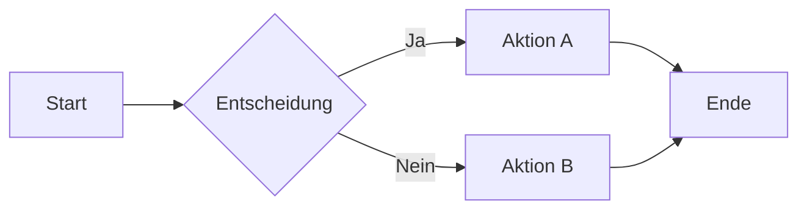
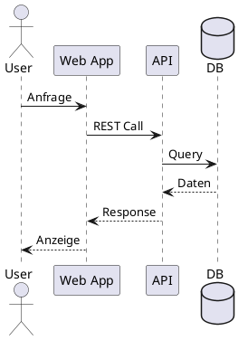

# Kroki-Diagrams Skill

## Zweck

Unified Diagramm-Generierung ueber Kroki. Alle Diagramme werden zu SVG pre-rendered und in `./assets/` gespeichert → **100% offline-faehiges HTML**.

## Warum Kroki?

| Aspekt | Vorteil |
|--------|---------|
| **Eine API** | 20+ Engines ueber einen Endpunkt |
| **Pre-Rendering** | SVG zur Build-Zeit, nicht Runtime |
| **Offline-faehig** | Kein CDN zur Laufzeit noetig |
| **Konsistent** | Einheitlicher Output (SVG) |
| **Erweiterbar** | Neue Engines ohne Code-Aenderung |

## Dual-Mode (Optional)

| Modus | Voraussetzung | Engines | Output |
|-------|---------------|---------|--------|
| **Kroki (Pre-Render)** | Docker laeuft | Alle 20+ Engines | SVG in assets/ |
| **Client-Side Fallback** | Kein Docker noetig | Nur Mermaid | Runtime via CDN |

Health-Check entscheidet automatisch welcher Modus genutzt wird.

## Unterstuetzte Engines

### Primaere Engines (empfohlen)

| Engine | Diagramm-Typen | Syntax |
|--------|----------------|--------|
| **mermaid** | Flowcharts, Sequenz, Gantt, ER, Pie, State | Mermaid-Syntax |
| **d2** | Architektur, System-Landschaften, komplexe Flows | D2-Syntax |
| **plantuml** | UML (Klassen, Aktivitaet, Use Case) | PlantUML-Syntax |
| **graphviz** | Netzwerke, Graphen, DOT-Diagramme | DOT-Syntax |
| **excalidraw** | Handgezeichnete Diagramme, informeller Stil | Excalidraw JSON |
| **bpmn** | Business Process Model and Notation | BPMN XML |
| **c4plantuml** | C4-Architektur-Modelle | C4 PlantUML-Syntax |

### Weitere Engines

blockdiag, seqdiag, actdiag, nwdiag, vega, vegalite, wavedrom, bytefield, nomnoml, svgbob

## Routing nach Diagramm-Typ

| Anforderung | Engine | Begruendung |
|-------------|--------|------------|
| Flowchart (einfach) | `mermaid` | Beste LLM-Kompatibilitaet |
| Flowchart (komplex, >15 Nodes) | `d2` | Besseres Auto-Layout |
| Sequenzdiagramm | `mermaid` | Sehr gut |
| Klassendiagramm | `plantuml` | UML-Standard |
| ER-Diagramm | `mermaid` | Einfach |
| Gantt-Chart | `mermaid` | Zeitplanung |
| Architektur-Diagramm | `d2` | Beste Aesthetik |
| Netzwerk-Topologie | `d2` oder `graphviz` | Spezialisiert |
| C4-Modell | `c4plantuml` | C4-spezifisch |
| Handgezeichnet/Skizze | `excalidraw` | Informeller Stil |

Vollstaendiges Engine-Routing: → `references/engine-routing.md`

## API-Nutzung

### Basis-URL

```
$KROKI_ENDPOINT/{engine}/{format}
```

### HTTP POST (empfohlen)

```bash
# Mermaid → SVG
curl -X POST $KROKI_ENDPOINT/mermaid/svg \
  -H "Content-Type: text/plain" \
  -d 'flowchart LR
    A[Start] --> B[Ende]' \
  -o diagram.svg
```

### Self-Hosted (Docker)

```bash
# Environment Variable
export KROKI_ENDPOINT="http://localhost:8000"

# Starten/Stoppen
cd ~/kroki && docker compose up -d
cd ~/kroki && docker compose down

# Health-Check
curl -sS $KROKI_ENDPOINT/health
```

Docker Compose Konfiguration: → `references/docker-compose.yml`

## Input (content.json)

```json
{
  "type": "diagram",
  "heading": "System-Architektur",
  "content": {
    "engine": "d2",
    "description": "Microservices-Architektur",
    "source": "server -> database: SQL\nserver -> cache: Redis"
  }
}
```

## Output

1. **SVG-Datei** in `./assets/`
2. **HTML-Referenz** fuer Assembly

```html
<section class="diagram">
    <h2>System-Architektur</h2>
    <figure>
        
        <figcaption>Microservices-Architektur</figcaption>
    </figure>
</section>
```

## Syntax-Referenzen

### Mermaid



### D2

```d2
direction: right
users: Users { shape: person }
api: API Gateway { shape: hexagon }
services: Backend {
  auth: Auth Service
  data: Data Service
}
db: Database { shape: cylinder }
users -> api: HTTPS
api -> services.auth
api -> services.data
services.auth -> db
services.data -> db
```

### PlantUML



## Fehlerbehandlung

| Fehler | Handling |
|--------|----------|
| Kroki nicht erreichbar | Fallback zu Client-Side Mermaid.js |
| Ungueltige Syntax | Fehlermeldung im SVG als Text |
| Timeout | Warnung, Platzhalter-SVG |

## Best Practices

✅ **Empfohlen:**
- Engine explizit angeben in content.json
- SVG-Format fuer Skalierbarkeit
- Aussagekraeftige Dateinamen (aus heading)
- Alt-Text fuer Barrierefreiheit
- Labels max. 15-20 Zeichen, bei laengeren `<br/>` nutzen

❌ **Vermeiden:**
- PNG wenn SVG moeglich
- Zu komplexe Diagramme (aufteilen)
- Inkonsistente Engine-Wahl
- Mehr als 15 Nodes ohne D2-Wechsel
