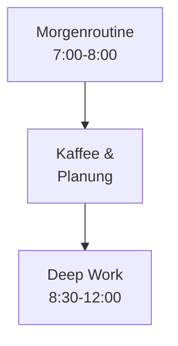

# Kroki Engine-Routing (Vollstaendige Referenz)

Detaillierte Entscheidungshilfe welche Kroki-Engine fuer welchen Diagramm-Typ gewaehlt wird.

**Hauptdatei:** `skills/kroki-diagrams/SKILL.md`

## Routing-Tabelle

| Anforderung | Engine | Begruendung |
|-------------|--------|------------|
| Flowchart (einfach, <15 Nodes) | `mermaid` | Beste LLM-Kompatibilitaet |
| Flowchart (komplex, >15 Nodes) | `d2` | Besseres Auto-Layout (ELK) |
| Sequenzdiagramm | `mermaid` | Sehr gut, einfache Syntax |
| Klassendiagramm | `plantuml` | UML-Standard |
| ER-Diagramm | `mermaid` | Einfache Syntax |
| Gantt-Chart | `mermaid` | Zeitplanung |
| State Machine | `mermaid` oder `plantuml` | Beide gut |
| Architektur-Diagramm | `d2` | Beste Aesthetik |
| Netzwerk-Topologie | `d2` oder `graphviz` | Spezialisiert |
| C4-Modell | `c4plantuml` | C4-spezifisch |
| BPMN-Prozesse | `bpmn` | Business Process Standard |
| Handgezeichnet/Skizze | `excalidraw` | Informeller Stil |
| Graphen/Dependencies | `graphviz` | DOT-Syntax |
| Pie-Chart (statisch) | `mermaid` | Einfach |
| Timeline | `mermaid` | Native Unterstuetzung |

## Engine-Vergleich

| Kriterium | Mermaid | D2 | PlantUML | GraphViz |
|-----------|---------|-----|----------|----------|
| **LLM-Kompatibilitaet** | Sehr hoch | Hoch | Mittel | Mittel |
| **Auto-Layout** | Gut | Sehr gut (ELK) | Gut | Sehr gut |
| **Aesthetik** | Gut | Sehr gut | Standard | Funktional |
| **Syntax-Komplexitaet** | Niedrig | Niedrig | Mittel | Mittel |
| **Diagramm-Vielfalt** | Hoch (10+ Typen) | Mittel | Sehr hoch (UML) | Graphen |
| **Text-Handling** | Gut (mit `<br/>`) | Sehr gut | Gut | Begrenzt |

## Entscheidungsbaum

```
Diagramm benoetigt?
├── UML-Standard? → plantuml / c4plantuml
├── Business Process? → bpmn
├── Handgezeichnet? → excalidraw
├── >15 Nodes? → d2
├── Architektur? → d2
├── Graph/Dependency? → graphviz
└── Alles andere → mermaid (Default)
```

## Mermaid Best Practices

### Text-Cutoff vermeiden

| Problem | Loesung |
|---------|---------|
| Text wird abgeschnitten | Zeilenumbrueche mit `<br/>` einfuegen |
| Box zu klein | Kuerzere Labels (max. 15-20 Zeichen) |
| Ueberlappende Nodes | Richtung aendern (LR statt TD) oder D2 |
| Zu viele Nodes | Auf mehrere Diagramme aufteilen |

### Empfohlene Label-Laenge

- **Kurz:** 1-2 Woerter (ideal)
- **Mittel:** 3-4 Woerter mit `<br/>`
- **Lang:** Auf mehrere Zeilen aufteilen

### Beispiel: Lange Labels


